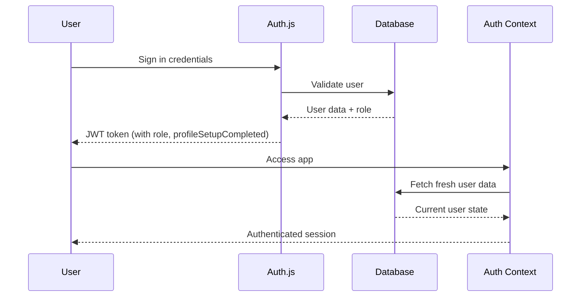

# Authentication System Documentation

## Overview

This project uses a hybrid authentication system combining **Auth.js (NextAuth v5)** with **Prisma** for optimal performance on Vercel's serverless platform. The system provides JWT-based authentication with real-time database synchronization for user data.

## Architecture

### 🏗️ **System Components**

```
┌─────────────────┐    ┌──────────────────┐    ┌─────────────────┐
│   Auth.js       │    │  Auth Context    │    │   Database      │
│   (NextAuth v5) │◄──►│  (React Hook)    │◄──►│   (Prisma)      │
└─────────────────┘    └──────────────────┘    └─────────────────┘
        │                       │                       │
        ▼                       ▼                       ▼
   JWT Tokens              User Session            Real-time Data
```

### 🔧 **Key Files**

- `src/lib/auth.ts` - Auth.js configuration
- `src/contexts/auth-context.tsx` - React authentication context
- `src/app/api/user/me/route.ts` - User data endpoint
- `src/app/dashboard/page.tsx` - Role-based routing

## Authentication Flow

### 1. **Sign In Process**



### 2. **Session Management**

The authentication system uses a **hybrid approach**:

#### **JWT Token (Primary)**
- Contains: `id`, `role`, `profileSetupCompleted`
- Advantages: Fast, serverless-compatible
- Limitations: Immutable until expiry

#### **Database Query (Secondary)**
- Fetched on session start and manual refresh
- Contains: Real-time `profileSetupCompleted`, updated `role`
- Priority: Database data overrides JWT data

```typescript
// Data priority logic
const user = {
  role: dbUser?.role || session.user.role || 'client',
  profileSetupCompleted: dbUser?.profileSetupCompleted ?? session.user.profileSetupCompleted ?? false
}
```

## Configuration

### **Environment Variables**

```bash
# Auth.js Configuration
AUTH_SECRET=your-secret-key
AUTH_TRUST_HOST=true

# OAuth Providers
AUTH_GOOGLE_ID=your-google-client-id
AUTH_GOOGLE_SECRET=your-google-client-secret
AUTH_FACEBOOK_ID=your-facebook-app-id
AUTH_FACEBOOK_SECRET=your-facebook-app-secret
AUTH_APPLE_ID=your-apple-service-id
AUTH_APPLE_SECRET=your-apple-private-key

# Database
DATABASE_URL=your-postgresql-connection-string

# Email (Resend)
RESEND_API_KEY=your-resend-api-key
```

### **Auth.js Setup** (`src/lib/auth.ts`)

```typescript
const config = {
  adapter: PrismaAdapter(prisma),
  providers: [
    Google({ /* config */ }),
    Facebook({ /* config */ }),
    Apple({ /* config */ }),
    Credentials({ /* email/password */ })
  ],
  session: {
    strategy: "jwt", // Required for Vercel
    maxAge: 30 * 24 * 60 * 60, // 30 days
  },
  callbacks: {
    jwt: ({ token, user }) => {
      // Add user data to JWT
      if (user) {
        token.role = user.role
        token.profileSetupCompleted = user.profileSetupCompleted
      }
      return token
    },
    session: ({ session, token }) => {
      // Transfer JWT data to session
      session.user.role = token.role
      session.user.profileSetupCompleted = token.profileSetupCompleted
      return session
    }
  }
}
```

## User Roles & Permissions

### **Role Hierarchy**

```typescript
enum UserRole {
  admin     // Full system access
  company   // Company dashboard + job posting
  client    // Individual job posting
  tasker    // Job application + profile
}
```

### **Role-Based Routing** (`src/app/dashboard/page.tsx`)

```typescript
// Admin can access any dashboard view
if (user.role === 'admin') {
  switch (dashboardView) {
    case 'client': return <ClientDashboard />
    case 'company': return <CompanyDashboard />
    case 'tasker': return <TaskerDashboard />
    default: return <AdminDashboard />
  }
}

// Regular users get role-specific dashboard
switch (user.role) {
  case 'client': return <ClientDashboard />
  case 'company': return <CompanyDashboard />
  case 'tasker': return <TaskerDashboard />
}
```

### **Permission Checking**

```typescript
const { user, hasRole, isAdmin, isClient, isTasker, isCompany } = useAuth()

// Check specific role
if (hasRole('admin')) {
  // Admin-only functionality
}

// Use helper booleans
if (isAdmin) {
  // Admin functionality
}
```

## API Endpoints

### **User Endpoints**

| Endpoint | Method | Description | Auth Required |
|----------|--------|-------------|---------------|
| `/api/user/me` | GET | Get current user data | ✅ |
| `/api/user/complete-profile` | PATCH | Mark profile setup complete | ✅ |

### **Admin Endpoints**

| Endpoint | Method | Description | Admin Required |
|----------|--------|-------------|----------------|
| `/api/admin/users` | GET | List all users | ✅ |
| `/api/admin/jobs` | GET | List all jobs | ✅ |
| `/api/admin/stats` | GET | Dashboard statistics | ✅ |
| `/api/admin/categories` | GET | Job categories | ✅ |
| `/api/admin/cities` | GET | Cities list | ✅ |
| `/api/admin/types` | GET | Job types with counts | ✅ |

### **Admin Authorization Pattern**

```typescript
// Standard admin check in API routes
const session = await auth()
if (!session?.user?.id) {
  return NextResponse.json({ error: 'Unauthorized' }, { status: 401 })
}

const user = await prisma.user.findUnique({
  where: { id: session.user.id },
  select: { role: true }
})

if (user?.role !== 'admin') {
  return NextResponse.json({ error: 'Access denied. Admin role required.' }, { status: 403 })
}
```

## Usage Examples

### **Basic Authentication Check**

```typescript
'use client'
import { useAuth } from '@/contexts/auth-context'

export function ProtectedComponent() {
  const { user, loading } = useAuth()
  
  if (loading) return <div>Loading...</div>
  if (!user) return <div>Please sign in</div>
  
  return <div>Welcome, {user.name}!</div>
}
```

### **Role-Based Content**

```typescript
export function RoleSpecificContent() {
  const { user, isAdmin, isClient } = useAuth()
  
  return (
    <div>
      {isAdmin && <AdminPanel />}
      {isClient && <ClientTools />}
      <UserProfile user={user} />
    </div>
  )
}
```

### **Manual User Data Refresh**

```typescript
export function ProfileSetupPage() {
  const { refreshUser } = useAuth()
  
  const handleProfileComplete = async () => {
    await fetch('/api/user/complete-profile', { method: 'PATCH' })
    await refreshUser() // Refresh user data immediately
    router.push('/dashboard')
  }
}
```

## Troubleshooting

### **Common Issues**

#### **Issue: User redirected to profile setup despite completion**
- **Cause**: JWT token doesn't have updated `profileSetupCompleted`
- **Solution**: The hybrid system automatically fetches fresh data from database

#### **Issue: Role changes not reflecting**
- **Cause**: JWT token contains cached role
- **Solution**: Database query overrides JWT role data

#### **Issue: Infinite API requests**
- **Cause**: useEffect dependency issues in auth context
- **Solution**: Fixed with proper dependency management and loading states

### **Development Tips**

1. **Testing Different Roles**: Admin users can access any dashboard view using URL parameter:
   ```
   /dashboard?view=client
   /dashboard?view=company
   /dashboard?view=tasker
   ```

2. **Force Token Refresh**: Have users sign out and sign back in to get fresh JWT tokens

3. **Database Debugging**: Use `refreshUser()` function to manually sync with database

## Migration Notes

### **From Clerk to Auth.js**

This system replaced Clerk authentication with Auth.js for:
- Better Vercel compatibility
- Reduced dependencies
- More control over authentication flow
- Cost optimization

### **JWT Strategy for Vercel**

Vercel deployment requires JWT strategy because:
- Serverless functions are stateless
- Database session adapters don't work reliably on edge
- JWT tokens work consistently across serverless environments

## Security Considerations

1. **JWT Secret**: Use strong, unique `AUTH_SECRET` in production
2. **OAuth Providers**: Properly configure redirect URIs for each provider
3. **Database Access**: All API routes validate session before database queries
4. **Role Validation**: Double-check user roles in both client and server code
5. **Session Duration**: 30-day JWT expiry provides good balance of security and UX

## Performance Optimizations

1. **Single DB Query**: Auth context makes only one database call per session
2. **Cached Roles**: JWT tokens cache role data for fast access
3. **Selective Loading**: Only fetch fresh data when needed
4. **Efficient Queries**: API endpoints use selective field queries with Prisma
