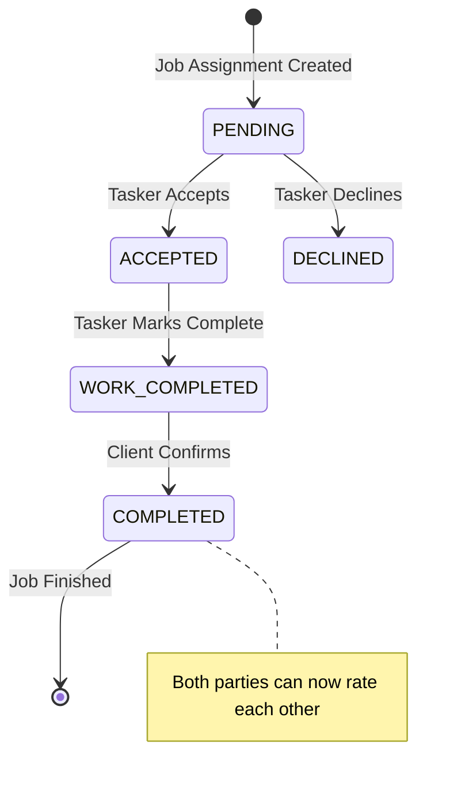

# Job Completion Workflow - API Reference

**Version**: 1.0  
**Date**: July 22, 2025  
**Base URL**: `/api/job-assignments`

## Overview

The Job Completion Workflow API provides endpoints for managing the completion process of assigned jobs. It enables taskers to mark work as completed and clients to confirm completion, finalizing the job workflow.

## Authentication

All endpoints require authentication via session cookies. The API uses the existing Next.js authentication system.

```http
Cookie: next-auth.session-token=<session-token>
```

## Endpoints

### 1. Mark Work as Completed

Allows the assigned tasker to mark their work as completed.

```http
POST /api/job-assignments/{jobAssignmentId}/complete-work
```

#### Parameters

| Parameter | Type | Location | Required | Description |
|-----------|------|----------|----------|-------------|
| jobAssignmentId | string | path | Yes | Unique identifier of the job assignment |

#### Request Body

```json
{
  "completionNotes": "string" // Optional notes about the completed work (max 1000 chars)
}
```

#### Response

**Success (200)**
```json
{
  "jobAssignment": {
    "id": "cuid123",
    "contractStatus": "WORK_COMPLETED",
    "workCompletedAt": "2025-07-22T10:30:00.000Z",
    "completionNotes": "Work completed as requested. All features implemented and tested.",
    "job": {
      "id": "job123",
      "title": "Frontend Developer Needed",
      "postedById": "client123"
    },
    "selectedApplication": {
      "user": {
        "id": "tasker123",
        "name": "John Doe",
        "email": "john@example.com"
      }
    }
  },
  "message": "Work marked as completed successfully. Waiting for client confirmation."
}
```

#### Error Responses

| Status Code | Error Code | Description |
|-------------|------------|-------------|
| 401 | UNAUTHORIZED | No valid session token provided |
| 403 | FORBIDDEN | User is not the assigned tasker |
| 404 | NOT_FOUND | Job assignment not found |
| 400 | INVALID_STATE | Work already completed or invalid state transition |
| 500 | INTERNAL_ERROR | Server error |

**Error Response Format**
```json
{
  "error": "Only the assigned tasker can mark work as completed",
  "code": "FORBIDDEN"
}
```

#### Example Request

```bash
curl -X POST \
  http://localhost:3000/api/job-assignments/cuid123/complete-work \
  -H 'Content-Type: application/json' \
  -H 'Cookie: next-auth.session-token=<token>' \
  -d '{
    "completionNotes": "Project completed successfully. Implemented all requested features and added responsive design."
  }'
```

### 2. Confirm Work Completion

Allows the client (job poster) to confirm that the work has been completed satisfactorily.

```http
POST /api/job-assignments/{jobAssignmentId}/confirm-completion
```

#### Parameters

| Parameter | Type | Location | Required | Description |
|-----------|------|----------|----------|-------------|
| jobAssignmentId | string | path | Yes | Unique identifier of the job assignment |

#### Request Body

```json
{
  "clientNotes": "string" // Optional feedback about the completed work (max 1000 chars)
}
```

#### Response

**Success (200)**
```json
{
  "jobAssignment": {
    "id": "cuid123",
    "contractStatus": "COMPLETED",
    "workCompletedAt": "2025-07-22T10:30:00.000Z",
    "clientConfirmedAt": "2025-07-22T14:45:00.000Z",
    "completedAt": "2025-07-22T14:45:00.000Z",
    "completionNotes": "Work completed as requested...",
    "clientNotes": "Excellent work! Exceeded expectations.",
    "job": {
      "id": "job123",
      "title": "Frontend Developer Needed",
      "postedById": "client123"
    },
    "selectedApplication": {
      "user": {
        "id": "tasker123",
        "name": "John Doe",
        "email": "john@example.com"
      }
    }
  },
  "message": "Work completion confirmed successfully. The job is now completed and both parties can rate each other."
}
```

#### Error Responses

| Status Code | Error Code | Description |
|-------------|------------|-------------|
| 401 | UNAUTHORIZED | No valid session token provided |
| 403 | FORBIDDEN | User is not the job poster |
| 404 | NOT_FOUND | Job assignment not found |
| 400 | INVALID_STATE | Work not marked as completed by tasker yet |
| 500 | INTERNAL_ERROR | Server error |

#### Example Request

```bash
curl -X POST \
  http://localhost:3000/api/job-assignments/cuid123/confirm-completion \
  -H 'Content-Type: application/json' \
  -H 'Cookie: next-auth.session-token=<token>' \
  -d '{
    "clientNotes": "Outstanding work! The website looks amazing and all functionality works perfectly."
  }'
```

### 3. Get Job Assignment Details

Retrieves detailed information about a job assignment including completion status.

```http
GET /api/job-assignments/{jobAssignmentId}
```

#### Parameters

| Parameter | Type | Location | Required | Description |
|-----------|------|----------|----------|-------------|
| jobAssignmentId | string | path | Yes | Unique identifier of the job assignment |

#### Response

**Success (200)**
```json
{
  "jobAssignment": {
    "id": "cuid123",
    "jobId": "job123",
    "selectedApplicationId": "app123",
    "contractStatus": "COMPLETED",
    "assignedAt": "2025-07-20T09:00:00.000Z",
    "workCompletedAt": "2025-07-22T10:30:00.000Z",
    "clientConfirmedAt": "2025-07-22T14:45:00.000Z",
    "completedAt": "2025-07-22T14:45:00.000Z",
    "agreedSalary": 1500,
    "completionNotes": "Work completed as requested...",
    "clientNotes": "Excellent work!",
    "notes": "Initial project notes",
    "createdAt": "2025-07-20T09:00:00.000Z",
    "updatedAt": "2025-07-22T14:45:00.000Z",
    "job": {
      "id": "job123",
      "title": "Frontend Developer Needed",
      "company": "Tech Startup Inc",
      "postedBy": {
        "id": "client123",
        "name": "Jane Smith",
        "email": "jane@techstartup.com"
      }
    },
    "selectedApplication": {
      "user": {
        "id": "tasker123",
        "name": "John Doe",
        "email": "john@example.com"
      }
    }
  }
}
```

## Data Models

### JobAssignment

| Field | Type | Description |
|-------|------|-------------|
| id | string | Unique identifier |
| jobId | string | Associated job ID |
| selectedApplicationId | string | Selected application ID |
| contractStatus | enum | Current status of the contract |
| assignedAt | DateTime | When the assignment was created |
| workCompletedAt | DateTime? | When tasker marked work complete |
| clientConfirmedAt | DateTime? | When client confirmed completion |
| completedAt | DateTime? | When the job was fully completed |
| agreedSalary | number? | Agreed upon salary/payment |
| completionNotes | string? | Tasker's completion notes |
| clientNotes | string? | Client's feedback notes |
| notes | string? | General assignment notes |

### ContractStatus Enum

| Value | Description |
|-------|-------------|
| PENDING | Assignment created, waiting for acceptance |
| ACCEPTED | Work has started |
| DECLINED | Assignment was declined |
| WORK_COMPLETED | Tasker marked work as completed |
| CONFIRMED_COMPLETED | Client confirmed completion (deprecated) |
| COMPLETED | Both parties confirmed completion |

## Workflow States



## Rate Limiting

| Endpoint | Rate Limit | Window |
|----------|------------|--------|
| POST /complete-work | 5 requests | 1 minute |
| POST /confirm-completion | 5 requests | 1 minute |
| GET /{id} | 100 requests | 1 minute |

## Webhooks

### Completion Events

The API can send webhook notifications for completion events:

#### work.completed
Triggered when a tasker marks work as completed.

```json
{
  "event": "work.completed",
  "timestamp": "2025-07-22T10:30:00.000Z",
  "data": {
    "jobAssignmentId": "cuid123",
    "jobId": "job123",
    "taskerId": "tasker123",
    "clientId": "client123",
    "completionNotes": "Work completed successfully"
  }
}
```

#### work.confirmed
Triggered when a client confirms work completion.

```json
{
  "event": "work.confirmed",
  "timestamp": "2025-07-22T14:45:00.000Z",
  "data": {
    "jobAssignmentId": "cuid123",
    "jobId": "job123",
    "taskerId": "tasker123",
    "clientId": "client123",
    "clientNotes": "Excellent work!"
  }
}
```

## SDK Examples

### JavaScript/TypeScript

```typescript
import { JobCompletionAPI } from '@/lib/api/job-completion';

const api = new JobCompletionAPI();

// Mark work as completed
try {
  const result = await api.markWorkCompleted('cuid123', {
    completionNotes: 'All features implemented successfully'
  });
  console.log('Work marked complete:', result.message);
} catch (error) {
  console.error('Failed to mark work complete:', error.message);
}

// Confirm completion
try {
  const result = await api.confirmCompletion('cuid123', {
    clientNotes: 'Outstanding work quality'
  });
  console.log('Completion confirmed:', result.message);
} catch (error) {
  console.error('Failed to confirm completion:', error.message);
}
```

### React Hook

```typescript
import { useJobCompletion } from '@/hooks/use-job-completion';

function JobCompletionCard({ jobAssignmentId }) {
  const { markComplete, confirmComplete, loading, error } = useJobCompletion();
  
  const handleMarkComplete = async () => {
    try {
      await markComplete(jobAssignmentId, {
        completionNotes: 'Work finished successfully'
      });
      toast.success('Work marked as completed!');
    } catch (err) {
      toast.error('Failed to mark work complete');
    }
  };
  
  return (
    <div>
      <button 
        onClick={handleMarkComplete}
        disabled={loading}
      >
        {loading ? 'Marking Complete...' : 'Mark Complete'}
      </button>
      {error && <p className="error">{error}</p>}
    </div>
  );
}
```

## Testing

### Test Environment

Base URL: `http://localhost:3000/api/job-assignments`

### Test Data

Use the following test job assignment ID for API testing:
- Job Assignment ID: `test_assignment_123`
- Tasker Session: Use test tasker account
- Client Session: Use test client account

### Postman Collection

Import the provided Postman collection for easy API testing:

```json
{
  "info": {
    "name": "Job Completion Workflow API",
    "description": "API endpoints for job completion workflow"
  },
  "item": [
    {
      "name": "Mark Work Complete",
      "request": {
        "method": "POST",
        "url": "{{baseUrl}}/job-assignments/{{jobAssignmentId}}/complete-work",
        "header": [
          {
            "key": "Content-Type",
            "value": "application/json"
          }
        ],
        "body": {
          "mode": "raw",
          "raw": "{\n  \"completionNotes\": \"Work completed successfully\"\n}"
        }
      }
    },
    {
      "name": "Confirm Completion",
      "request": {
        "method": "POST",
        "url": "{{baseUrl}}/job-assignments/{{jobAssignmentId}}/confirm-completion",
        "header": [
          {
            "key": "Content-Type",
            "value": "application/json"
          }
        ],
        "body": {
          "mode": "raw",
          "raw": "{\n  \"clientNotes\": \"Excellent work quality\"\n}"
        }
      }
    }
  ],
  "variable": [
    {
      "key": "baseUrl",
      "value": "http://localhost:3000/api"
    },
    {
      "key": "jobAssignmentId",
      "value": "test_assignment_123"
    }
  ]
}
```

---

**API Version**: 1.0  
**Documentation Updated**: July 22, 2025  
**Support**: development-team@example.com
