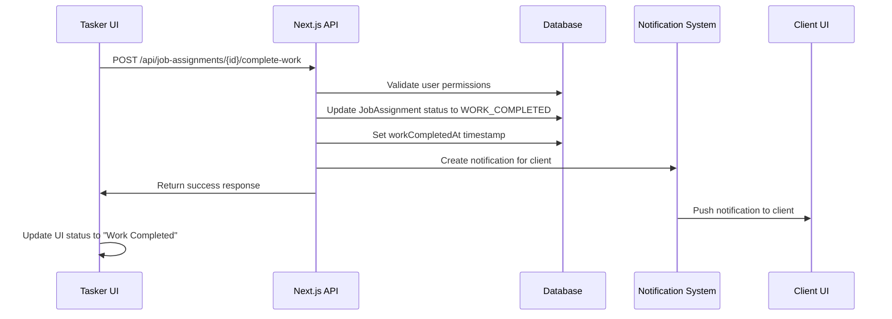
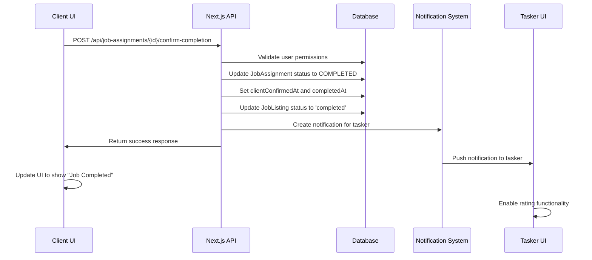

# Job Completion Workflow - Technical Architecture

**Date**: July 22, 2025  
**Type**: Technical Documentation  
**Audience**: Developers, DevOps, Technical Team

## System Architecture

### Component Overview
```
┌─────────────────┐    ┌─────────────────┐    ┌─────────────────┐
│   Client UI     │    │   Tasker UI     │    │  Admin Panel    │
│  (Dashboard)    │    │  (Dashboard)    │    │   (Optional)    │
└─────┬───────────┘    └─────┬───────────┘    └─────┬───────────┘
      │                      │                      │
      └──────┬─────────────┬─┘                      │
             │             │                        │
      ┌─────▼─────────────▼─────────────────────────▼─┐
      │           React Frontend                      │
      │    - DashboardApplicationManager              │
      │    - JobCompletionCard                        │
      │    - Status Indicators                        │
      └─────────────────┬─────────────────────────────┘
                        │ HTTP Requests
      ┌─────────────────▼─────────────────────────────┐
      │              Next.js API                      │
      │    - /api/job-assignments/[id]/complete-work  │
      │    - /api/job-assignments/[id]/confirm-comp.. │
      │    - /api/client/applications (enhanced)      │
      └─────────────────┬─────────────────────────────┘
                        │ Prisma ORM
      ┌─────────────────▼─────────────────────────────┐
      │           PostgreSQL Database                 │
      │    - JobAssignment (enhanced)                 │
      │    - Notification                             │
      │    - JobListing                               │
      └───────────────────────────────────────────────┘
```

## Data Flow Diagrams

### 1. Tasker Marks Work Complete


### 2. Client Confirms Completion


## Database Schema Details

### Migration SQL
```sql
-- Add new enum values to ContractStatus
ALTER TYPE "ContractStatus" ADD VALUE 'WORK_COMPLETED';
ALTER TYPE "ContractStatus" ADD VALUE 'CONFIRMED_COMPLETED';

-- Add new columns to job_assignments table
ALTER TABLE "job_assignments" 
ADD COLUMN "work_completed_at" TIMESTAMP(3),
ADD COLUMN "client_confirmed_at" TIMESTAMP(3),
ADD COLUMN "completed_at" TIMESTAMP(3),
ADD COLUMN "completion_notes" TEXT,
ADD COLUMN "client_notes" TEXT;

-- Add indexes for performance
CREATE INDEX "idx_job_assignments_contract_status" ON "job_assignments"("contractStatus");
CREATE INDEX "idx_job_assignments_completed_at" ON "job_assignments"("completed_at");
```

### Data Relationships
```
JobListing (1) ←→ (1) JobAssignment ←→ (1) Application
    ↓                      ↓                    ↓
 status              contractStatus          status
    ↓                      ↓                    ↓
completed           WORK_COMPLETED        SELECTED
                         ↓
                    COMPLETED
```

## API Endpoint Specifications

### 1. Complete Work Endpoint

**Endpoint**: `POST /api/job-assignments/[id]/complete-work`

**Request Schema**:
```typescript
interface CompleteWorkRequest {
  completionNotes?: string; // Optional notes from tasker
}
```

**Response Schema**:
```typescript
interface CompleteWorkResponse {
  jobAssignment: {
    id: string;
    contractStatus: 'WORK_COMPLETED';
    workCompletedAt: Date;
    completionNotes?: string;
    job: {
      id: string;
      title: string;
      postedById: string;
    };
    selectedApplication: {
      user: {
        id: string;
        name: string;
        email: string;
      };
    };
  };
  message: string;
}
```

**Error Responses**:
- `401`: Unauthorized - No valid session
- `403`: Forbidden - Not the assigned tasker
- `404`: Not Found - Job assignment doesn't exist
- `400`: Bad Request - Work already completed or invalid state
- `500`: Internal Server Error

### 2. Confirm Completion Endpoint

**Endpoint**: `POST /api/job-assignments/[id]/confirm-completion`

**Request Schema**:
```typescript
interface ConfirmCompletionRequest {
  clientNotes?: string; // Optional feedback from client
}
```

**Response Schema**:
```typescript
interface ConfirmCompletionResponse {
  jobAssignment: {
    id: string;
    contractStatus: 'COMPLETED';
    clientConfirmedAt: Date;
    completedAt: Date;
    clientNotes?: string;
    // ... other fields
  };
  message: string;
}
```

## Component Architecture

### React Component Hierarchy
```
DashboardApplicationManager
├── ApplicationCard
│   ├── ApplicationStatus Badge
│   ├── User Information
│   ├── Application Actions
│   └── CompletionWorkflow
│       ├── TaskerCompleteButton (if tasker + ACCEPTED)
│       ├── ClientConfirmButton (if client + WORK_COMPLETED)
│       └── CompletionStatusBadge
└── BulkActions

JobCompletionCard (Standalone)
├── JobHeader
├── StatusBadge
├── TaskerSection (if role=tasker)
│   ├── CompletionForm
│   └── SubmitButton
├── ClientSection (if role=client)
│   ├── ReviewForm
│   └── ConfirmButton
└── CompletedSection (if status=COMPLETED)
    └── RatingButton
```

### State Management
```typescript
// Component State
interface CompletionState {
  loading: boolean;
  completionNotes: string;
  clientNotes: string;
  error?: string;
}

// Application State (from context/props)
interface ApplicationState {
  applications: JobApplication[];
  selectedApplications: string[];
  filters: FilterState;
}

// Global State (notifications)
interface NotificationState {
  notifications: Notification[];
}
```

## Security Implementation

### Authentication & Authorization
```typescript
// Middleware validation
const validateUser = async (session: Session) => {
  if (!session?.user?.email) {
    throw new UnauthorizedError();
  }
  
  const user = await prisma.user.findUnique({
    where: { email: session.user.email }
  });
  
  if (!user) {
    throw new NotFoundError('User not found');
  }
  
  return user;
};

// Permission checks
const validateTaskerPermission = (jobAssignment: JobAssignment, userId: string) => {
  if (jobAssignment.selectedApplication.user.id !== userId) {
    throw new ForbiddenError('Only assigned tasker can mark work complete');
  }
};

const validateClientPermission = (jobAssignment: JobAssignment, userId: string) => {
  if (jobAssignment.job.postedById !== userId) {
    throw new ForbiddenError('Only job poster can confirm completion');
  }
};
```

### Input Validation
```typescript
// Zod schemas for validation
const completeWorkSchema = z.object({
  completionNotes: z.string().max(1000).optional()
});

const confirmCompletionSchema = z.object({
  clientNotes: z.string().max(1000).optional()
});
```

## Error Handling Strategy

### API Error Handling
```typescript
// Standardized error responses
class APIError extends Error {
  statusCode: number;
  code: string;
  
  constructor(message: string, statusCode: number, code: string) {
    super(message);
    this.statusCode = statusCode;
    this.code = code;
  }
}

// Error handler middleware
const handleAPIError = (error: unknown) => {
  if (error instanceof APIError) {
    return NextResponse.json(
      { error: error.message, code: error.code },
      { status: error.statusCode }
    );
  }
  
  console.error('Unexpected error:', error);
  return NextResponse.json(
    { error: 'Internal server error' },
    { status: 500 }
  );
};
```

### Client Error Handling
```typescript
// React error boundaries
class CompletionErrorBoundary extends React.Component {
  componentDidCatch(error: Error, errorInfo: ErrorInfo) {
    console.error('Completion workflow error:', error);
    // Report to error tracking service
  }
  
  render() {
    if (this.state.hasError) {
      return <ErrorFallback onRetry={this.handleRetry} />;
    }
    
    return this.props.children;
  }
}

// API call error handling
const handleCompletionError = (error: unknown) => {
  if (error instanceof Error) {
    toast.error(error.message);
  } else {
    toast.error('An unexpected error occurred');
  }
  
  // Log for debugging
  console.error('Completion action failed:', error);
};
```

## Performance Optimizations

### Database Optimizations
```sql
-- Indexes for common queries
CREATE INDEX CONCURRENTLY "idx_job_assignments_status_user" 
ON "job_assignments"("contractStatus", "selectedApplicationId");

CREATE INDEX CONCURRENTLY "idx_job_assignments_job_status" 
ON "job_assignments"("jobId", "contractStatus");

-- Query optimization example
SELECT ja.*, j.title, u.name as tasker_name
FROM job_assignments ja
JOIN job_listings j ON ja.job_id = j.id
JOIN applications a ON ja.selected_application_id = a.id
JOIN users u ON a.user_id = u.id
WHERE j.posted_by_id = $1
AND ja.contract_status IN ('WORK_COMPLETED', 'COMPLETED')
ORDER BY ja.updated_at DESC;
```

### React Performance
```typescript
// Memoized components
const ApplicationCard = React.memo(({ application, onUpdate }) => {
  return (
    <Card>
      {/* Component content */}
    </Card>
  );
});

// Optimized state updates
const useOptimisticUpdate = () => {
  const [applications, setApplications] = useState([]);
  
  const updateApplicationOptimistically = useCallback((id, updates) => {
    setApplications(prev => 
      prev.map(app => 
        app.id === id ? { ...app, ...updates } : app
      )
    );
  }, []);
  
  return { applications, updateApplicationOptimistically };
};
```

## Monitoring & Observability

### Logging Strategy
```typescript
// Structured logging
const logger = {
  info: (message: string, context: object) => {
    console.log(JSON.stringify({
      level: 'info',
      message,
      timestamp: new Date().toISOString(),
      ...context
    }));
  },
  
  error: (message: string, error: Error, context: object) => {
    console.error(JSON.stringify({
      level: 'error',
      message,
      error: error.message,
      stack: error.stack,
      timestamp: new Date().toISOString(),
      ...context
    }));
  }
};

// Usage in API endpoints
logger.info('Work marked as completed', {
  jobAssignmentId: id,
  userId: user.id,
  hasNotes: !!completionNotes
});
```

### Metrics Collection
```typescript
// Custom metrics
interface CompletionMetrics {
  totalCompletions: number;
  avgCompletionTime: number;
  completionRate: number;
  userSatisfaction: number;
}

// Metric collection points
const trackCompletionEvent = (event: string, properties: object) => {
  // Send to analytics service
  analytics.track(event, {
    timestamp: Date.now(),
    userId: user.id,
    ...properties
  });
};
```

## Testing Strategy

### Unit Tests
```typescript
// API endpoint tests
describe('Complete Work Endpoint', () => {
  it('should mark work as completed for valid tasker', async () => {
    const response = await request(app)
      .post('/api/job-assignments/test-id/complete-work')
      .set('Cookie', validTaskerSession)
      .send({ completionNotes: 'Work completed' })
      .expect(200);
      
    expect(response.body.jobAssignment.contractStatus).toBe('WORK_COMPLETED');
  });
  
  it('should reject unauthorized users', async () => {
    await request(app)
      .post('/api/job-assignments/test-id/complete-work')
      .set('Cookie', invalidSession)
      .expect(401);
  });
});
```

### Integration Tests
```typescript
// Full workflow test
describe('Completion Workflow Integration', () => {
  it('should complete full workflow from assignment to completion', async () => {
    // 1. Create job assignment
    const assignment = await createTestJobAssignment();
    
    // 2. Tasker marks complete
    await markWorkComplete(assignment.id, taskerSession);
    
    // 3. Verify status change
    const updated = await getJobAssignment(assignment.id);
    expect(updated.contractStatus).toBe('WORK_COMPLETED');
    
    // 4. Client confirms completion
    await confirmCompletion(assignment.id, clientSession);
    
    // 5. Verify final state
    const completed = await getJobAssignment(assignment.id);
    expect(completed.contractStatus).toBe('COMPLETED');
    expect(completed.completedAt).toBeTruthy();
  });
});
```

## Deployment Guide

### Environment Setup
```bash
# 1. Install dependencies
npm install

# 2. Run database migration
npx prisma migrate deploy

# 3. Generate Prisma client
npx prisma generate

# 4. Build application
npm run build

# 5. Start production server
npm start
```

### Production Checklist
- [ ] Database migration applied
- [ ] Environment variables configured
- [ ] Error tracking setup (Sentry, etc.)
- [ ] Monitoring dashboards configured
- [ ] Load testing completed
- [ ] Security audit passed
- [ ] Documentation updated
- [ ] Team training completed

---

**Document Version**: 1.0  
**Last Updated**: July 22, 2025  
**Maintained By**: Development Team  
**Review Schedule**: Monthly
